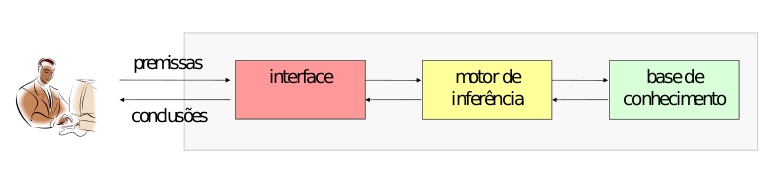

# Logical Paradigm (declarative)


A programação lógica se basea em 3 princípios:
 * linguagem formal para representação de conhecimento
 * regras de inferência para manipulação de conhecimento
 * estratégia de busca para controle de inferências

# Prolog Language


 <p> - Interface: permite que o usuário entre com premissas codificadas em
uma linguagem lógica e faça consultas para extrair conclusões destas
premissas</p>
<p> - Motor de inferência: atualiza a base de conhecimento com
premissas fornecidas pelo usuário e faz inferências para extrair
informações implı́citas.</p>
<p> - Base de conhecimento: armazena fatos e regras, fornecidas pelo usuário.</p>
 Ex)

**FACTS**

`progenitor(boris, jane).`<br/>
`progenitor(boris, marcia).`<br/>
`progenitor(adelia, jane).`<br/>
`progenitor(jane, tiago).`<br/>
 

**RULES**

`avo(X,Z) :- progenitor(X,Y), progenitor(Y,Z).`<br/>


### Intallation
```sh
sudo apt-get install software-properties-common

sudo apt-add-repository ppa:swi-prolog/stable
sudo apt-get update
sudo apt-get install swi-prolog
```

---

#### References
- [Prolog Documentation](https://www.swi-prolog.org/)

---

<p  align="left">
	<br/>
	<a href="mailto:brunocampos01@gmail.com" target="_blank">
	</a>
	<a href="https://stackoverflow.com/users/8329698/bruno-campos" target="_blank">
	</a>
	<a href="https://www.linkedin.com/in/brunocampos01" target="_blank">
	</a>
	<a href="https://github.com/brunocampos01" target="_blank"></a>
	<a href="https://medium.com/@brunocampos01" target="_blank">
	</a>
    <a rel="license" href="http://creativecommons.org/licenses/by-sa/4.0/">
    </a>
    <br/>
</p>
